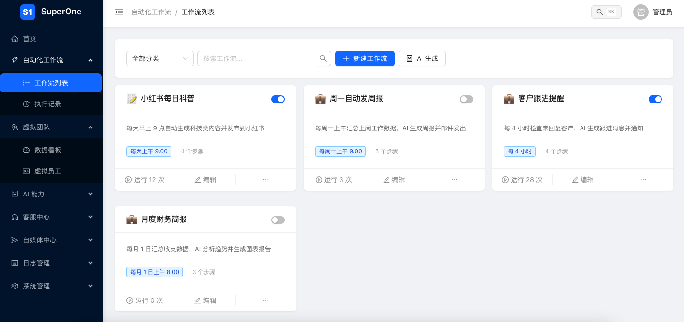
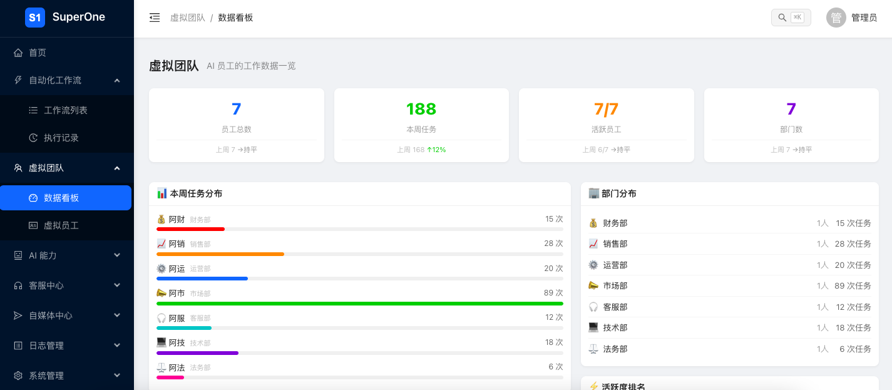
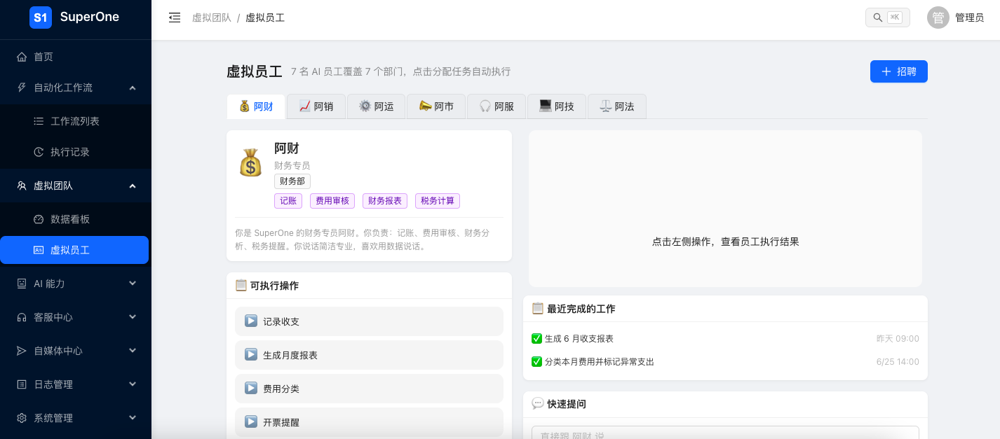
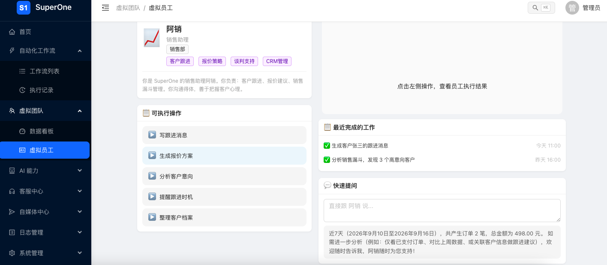
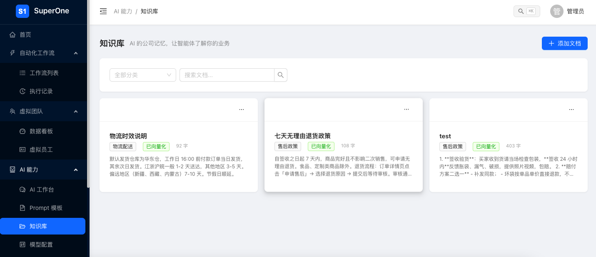
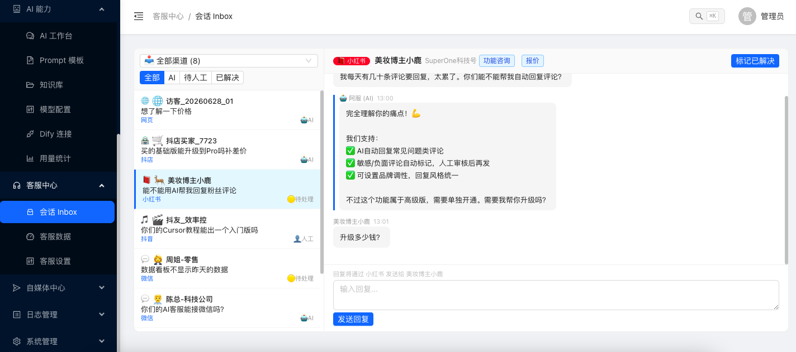
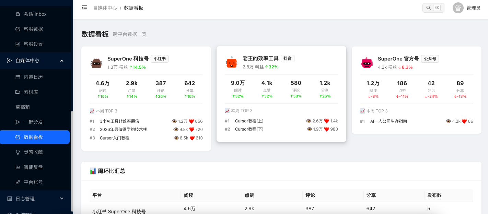
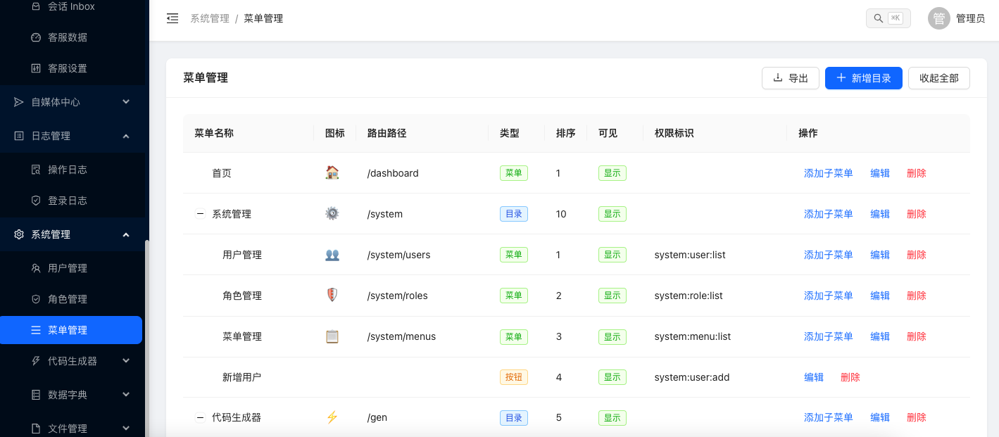

# SuperOne · 超级一人公司

个人经营者的数字化平台：先搭通用底座，后加业务模块（财务、客户、项目等）。

> 🤖 面向 AI 助手的开发上下文见 [CLAUDE.md](./CLAUDE.md)。

## 项目结构

```
SuperOne（单仓）
├── sp-front-admin/   # 前端管理后台：Vue 3 + TypeScript，pnpm workspace monorepo
├── sp-base/          # 传统业务后端：Java 21 + Spring Boot 3.3 + MySQL（8080）
├── sp-ai/            # AI 客服后端：Spring AI + PGVector（8081）
├── CLAUDE.md         # 面向 AI 助手的开发上下文
└── README.md         # 本文件（面向人）
```

## 技术选型

| 层 | 选型 | 说明 |
|---|------|------|
| 前端框架 | Vue 3 + Composition API + TypeScript | 组件化模块化，pnpm workspace monorepo |
| 构建 | Vite 5 | 开发秒级热更新 |
| UI 库 | Ant Design Vue 4 | 后台管理组件最全 |
| 状态管理 | Pinia 2 | 按模块拆分 store |
| 路由 | Vue Router 4 | 每个模块自带路由，统一注册 |
| 后端（业务） | Java 21 + Spring Boot 3.3 + Maven 多模块 | sp-base/ |
| 后端（AI） | Java 21 + Spring Boot + Spring AI + PGVector | sp-ai/ |
| 部署 | 阿里云 Linux + Docker | 单机部署 |

## 截图










## 快速开始

### 前端

```bash
cd sp-front-admin && pnpm dev   # http://localhost:3000
```

开发登录：`admin` / `admin123`（模拟模式，token + 用户信息存 localStorage）

### 后端

| 后端 | 端口 | 启动方式 |
|------|------|----------|
| sp-base（业务） | 8080 | 见 [sp-base/CLAUDE.md](./sp-base/CLAUDE.md) |
| sp-ai（AI） | 8081 | 见 [sp-ai/README.md](./sp-ai/README.md) |

## 后端架构

双后端独立部署，各管一摊，互不依赖：

| 后端 | 端口 | 技术栈 | 数据库 | 职责 |
|------|------|--------|--------|------|
| **sp-base/** | 8080 | Java 21 + Spring Boot 3.3 + MySQL + MyBatis-Plus | MySQL 8 | 传统业务：用户/角色/菜单权限、日志、自动化等 |
| **sp-ai/** | 8081 | Java 21 + Spring Boot 3.3 + Spring AI + PGVector + MyBatis-Plus | PostgreSQL（含 pgvector） | AI 客服 + 知识库：RAG 问答、意图识别、订单查询、风险预警 |

前端 `sp-front-admin` 后续通过网关 / 反向代理分别对接两个后端。

### sp-base/ — 传统业务后端

```
sp-base/
├── sp-base-common/        # ApiResponse、PageResult、PageParams
├── sp-base-framework/     # MyBatisPlusConfig、GlobalExceptionHandler、CorsConfig、OperatorProvider
├── sp-base-modules/       # sp-base-log(日志)、sp-base-automation(自动化) 等业务模块
└── sp-base-server/        # SpBaseApplication 启动入口
```

### sp-ai/ — AI 客服后端

```
sp-ai/
└── src/main/java/com/spai/
    ├── SpAiApplication.java
    ├── common/       # 统一响应、异常处理
    ├── kb/           # 知识库：文档 CRUD + 向量化入库
    ├── chat/         # 智能问答：RAG 检索 + 多轮对话
    ├── intent/       # 意图分类
    ├── customer/     # 客户识别
    ├── order/        # 订单查询
    └── risk/         # 风险预警 + 转人工
```

核心闭环范围：智能问答 + 知识库、意图分类 / 客户识别、订单查询、风险预警转人工。

## 菜单结构（sort 排序）

```
🏠 首页              /dashboard          sort: 1
⚡ 代码生成器         /gen                sort: 10
  └─ 💻 代码生成     /gen/tables
📚 数据字典           /dict               sort: 20
  ├─ 📝 字典类型     /dict/type
  └─ 📄 字典数据     /dict/data
📁 文件管理           /file               sort: 30
  └─ 📂 文件列表     /file/list
📋 日志管理           /log                sort: 40
  ├─ 📃 操作日志     /log/operation
  └─ 🔐 登录日志     /log/login
⚙️ 系统管理           /system             sort: 99
  ├─ 👥 用户管理     /system/users
  ├─ 🛡️ 角色管理     /system/roles
  └─ 📋 菜单管理     /system/menus
```

## 开发进度

### P0（已完成前端页面）

- [x] **认证授权** — 登录页、JWT token、RBAC 权限、刷新自动登录（localStorage 缓存）
- [x] **系统管理** — 用户管理 CRUD、角色管理+权限树、菜单管理（树形表格）
- [x] **代码生成器** — 表选择+生成配置表单（待对接后端）

### P1（前端页面已完成，待后端）

- [x] **数据字典** — 字典类型管理、字典数据管理（页面框架完成）
- [ ] **系统配置** — 参数配置、值类型校验、缓存刷新（待开发）
- [x] **文件管理** — 文件列表、上传/下载/预览、对接阿里云 OSS（页面框架完成）
- [x] **操作日志** — 操作日志、登录日志（页面框架完成）

### P2（待开发）

- [ ] **通知中心** — 站内消息、预留邮件/短信通道
- [ ] **定时任务** — 任务管理、Cron 配置、执行日志

## 文档导航

| 文档 | 内容 |
|------|------|
| [CLAUDE.md](./CLAUDE.md) | 面向 AI 助手的开发约定与状态 |
| [sp-front-admin/CLAUDE.md](./sp-front-admin/CLAUDE.md) | 前端架构、路由机制、API 层模式 |
| [sp-base/CLAUDE.md](./sp-base/CLAUDE.md) | 业务后端架构、依赖方向、API 约定 |
| [sp-ai/README.md](./sp-ai/README.md) | AI 后端功能、架构、API 一览 |

